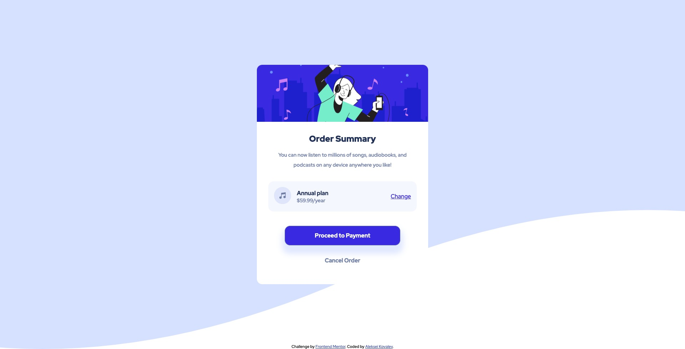

# Frontend Mentor - Order summary card solution

This is a solution to the [Order summary card challenge on Frontend Mentor](https://www.frontendmentor.io/challenges/order-summary-component-QlPmajDUj).

## Table of contents

- [Frontend Mentor - Order summary card solution](#frontend-mentor---order-summary-card-solution)
  - [Table of contents](#table-of-contents)
  - [Overview](#overview)
    - [The challenge](#the-challenge)
    - [Screenshot](#screenshot)
    - [Links](#links)
    - [Built with](#built-with)
  - [Author](#author)

## Overview

### The challenge

Users should be able to:

- See hover states for interactive elements

### Screenshot

### Links

- [Solution](https://your-solution-url.com)
- [Live Site](https://kalexei-order-summary.netlify.app)

### Built with

- Semantic HTML5 markup
- CSS custom properties
- CSS variables
- Flexbox
- Mobile-first workflow

## Author

- Website - [Aleksei Kovalev](https://www.your-site.com)
- Frontend Mentor - [@AlekseiK412](https://www.frontendmentor.io/profile/AlekseiK412)
- Twitter - [@_kalexei_](https://www.twitter.com/_kalexei_)
